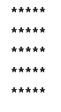
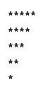
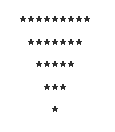
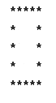

Visit [DSA Study Plan](https://yukidaruma905.github.io/DSA_Study_Plan/)

---

# Content

## Step 1: Learn the basics

Step 1.1: Things to Know in C++ or any language

- [x] User Input/Output.
- [x] Data Types.
- [x] If Else statements.
- [x] Switch Statement.
- [x] What are arrays?
- [x] For loops.
- [x] While loops.
- [x] Functions (Pass by Reference and Value).
- [ ] What are strings?
- [ ] Time Complexity (Learn Basics, and then analyze in next Step.

Step 1.2: Build-up Logical Thinking

|Check                   |No.   |Pattern            |
|:----------------------:|:----:|:-----------------:|
|<ul><li>- [ ] </li></u1>|  1   | |
|<ul><li>- [ ] </li></u1>|  2   | |
|<ul><li>- [ ] </li></u1>|  3   | |
|<ul><li>- [ ] </li></u1>|  4   | |
|<ul><li>- [ ] </li></u1>|  5   | |
|<ul><li>- [ ] </li></u1>|  6   | |
|<ul><li>- [ ] </li></u1>|  7   | |
|<ul><li>- [ ] </li></u1>|  8   | |
|<ul><li>- [ ] </li></u1>|  9   | |
|<ul><li>- [ ] </li></u1>|  10  ||
|<ul><li>- [ ] </li></u1>|  11  ||
|<ul><li>- [ ] </li></u1>|  12  ||
|<ul><li>- [ ] </li></u1>|  13  ||
|<ul><li>- [ ] </li></u1>|  14  ||
|<ul><li>- [ ] </li></u1>|  15  ||
|<ul><li>- [ ] </li></u1>|  16  ||
|<ul><li>- [ ] </li></u1>|  17  ||
|<ul><li>- [ ] </li></u1>|  18  ||
|<ul><li>- [ ] </li></u1>|  19  ||
|<ul><li>- [ ] </li></u1>|  20  ||
|<ul><li>- [ ] </li></u1>|  21  ||
|<ul><li>- [ ] </li></u1>|  22  ||

Step 1.3: Learn STL/cpp-Collections or similar thing in your language.

- [ ] Unordered set.
- [ ] Vectors.
- [ ] Set.
- [ ] Unordered multiset.
- [ ] Multiset.
- [ ] Unordered map.
- [ ] Unordered multimap.
- [ ] Queue.
- [ ] Stack.
- [ ] Deque.
- [ ] Priority queue.
- [ ] Multimap.
- [ ] List.
- [ ] Next permutation.
- [ ] builtin_popcount().
- [ ] sort().
- [ ] min_element().
- [ ] max_element().

Step 1.4: Know Basic Maths

- [ ]  Count Digits
- [ ]  Reverse a Number
- [ ]  Check Palindrome
- [ ]  GCD or HCF
- [ ]  Armstrong Numbers
- [ ]  Print all Divisors
- [ ]  Check for Prime

Step 1.5: Learn Basic Recursion

- [ ]  Understand recursion by print something N times
- [ ]  Print name N times using recursion
- [ ]  Print 1 to N using recursion
- [ ]  Print N to 1 using recursion
- [ ]  Sum of first N numbers
- [ ]  Factorial of N numbers
- [ ]  Reverse an array
- [ ]  Check if a string is palindrome or not
- [ ]  Fibonacci Number

Step 1.6: Learn Basic Hashing

- [ ]  Counting frequencies of array elements
- [ ]  Find the highest/lowest frequency element

